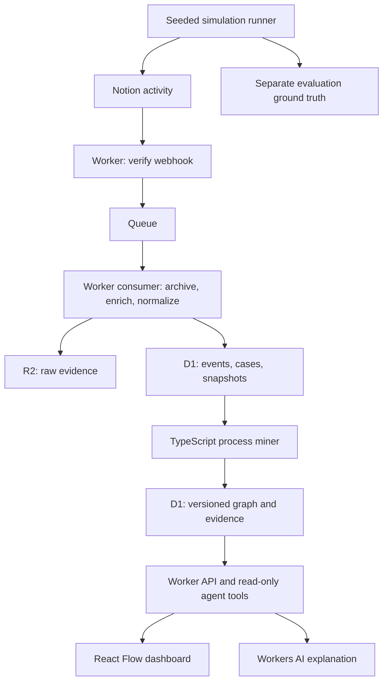

# Proposed Cloudflare stack for AriadneOS

Research date: 2026-09-12. Status: recommendation, not an adopted architecture or deployed implementation. The repository currently contains the product README only. This proposal prioritizes its one-day, single-organization Notion demo and preserves a path toward multiple connectors.

**Recommendation:** TypeScript, React/Vite, Hono on Cloudflare Workers, D1 with Drizzle, Queues, R2, React Flow with Dagre, and Workers AI. Implement the first process miner as a small deterministic TypeScript module. Add Cloudflare Workflows when durable simulation or execution becomes necessary.

| Need | Choice | Reason and scope |
| --- | --- | --- |
| Dashboard and hosting | React + Vite + Workers Static Assets | One full-stack project with Cloudflare's supported Vite integration; a graph dashboard does not need server rendering. [Cloudflare guide](https://developers.cloudflare.com/workers/framework-guides/web-apps/react/) |
| API and connector runtime | TypeScript + Hono on Workers | Share event types across UI, ingestion, and mining. Hono has a documented Workers deployment path. [Hono guide](https://hono.dev/docs/getting-started/cloudflare-workers) |
| Queryable state | D1 + Drizzle | Store events, cases, artifact snapshots, model versions, and graph evidence in SQL. Drizzle supports the D1 binding and migrations. [Drizzle D1 integration](https://orm.drizzle.team/docs/sqlite/connect-cloudflare-d1) |
| Background ingestion | Cloudflare Queues + dead-letter queue | Separate webhook acknowledgment from enrichment and mining. Consumers must deduplicate because delivery is at least once. [Delivery guarantees](https://developers.cloudflare.com/queues/reference/delivery-guarantees/) |
| Raw evidence and replay | R2 | Keep original webhook payloads, simulation fixtures, and exports as objects, with references in D1. [R2 overview](https://developers.cloudflare.com/r2/) |
| Process visualization | React Flow + Dagre | Interactive nodes and edges with evidence panels; Dagre supplies automatic layout. [Layout options](https://reactflow.dev/learn/layouting/layouting) |
| Agent explanation | Workers AI with a function-calling model | Query measured process data through narrow tools; validate model choice against demo questions. [Function calling](https://developers.cloudflare.com/workers-ai/features/function-calling/) |
| Private demo access | Cloudflare Access | Protect dashboard/API and validate the Access JWT at the Worker. Keep the separately authenticated Notion webhook reachable. [JWT validation](https://developers.cloudflare.com/cloudflare-one/access-controls/applications/http-apps/authorization-cookie/validating-json/) |
| Durable orchestration, later | Cloudflare Workflows | Useful for simulation runs, resumable imports, retries, and execution that waits for people. It orchestrates authored code; it does not discover business processes. [Workflows overview](https://developers.cloudflare.com/workflows/) |



Start with one Worker codebase exporting HTTP, queue, and scheduled handlers, one D1 database, one R2 bucket, and an ingestion queue plus its dead-letter queue. Poll the graph API every few seconds for the demo. Keep mining independent of Cloudflare bindings so the same module runs on fixtures locally.

**The key connector constraint**

Notion webhooks announce changes rather than supply a complete change history. Some events aggregate edits, can have multiple authors, and may arrive out of order. Fetching the latest page after a notification cannot recover every intermediate status. Therefore, treat snapshot differences as observations with uncertainty rather than exact user actions. [Notion event delivery](https://developers.notion.com/reference/webhooks-events-delivery)

For the demo, give each request page a stable `Case ID`, workflow type, status, and assigned role. Preserve all source authors; do not equate a shared integration bot with the simulated employee. The simulator can identify its logical actor separately, but label that as simulation metadata.

Verify the HMAC over the raw request body before accepting events, and acknowledge only after the queue send succeeds. The initial subscription verification is a separate setup step. [Notion webhook verification](https://developers.notion.com/reference/webhooks)

Archive the raw event under a stable R2 key, fetch relevant Notion state, then persist normalized events and processing status. Use idempotent object keys and database uniqueness constraints so retries can finish a partial operation. D1 and R2 do not form one application transaction. Mark an event processed only after required writes succeed; acknowledge the queue message afterward. Route exhausted retries to a dead-letter queue with a replay command.

Throttle enrichment for the single demo connection and honor `Retry-After`, including overload responses. Current Notion limits vary by plan and include a shared workspace budget, so do not hard-code one universal requests-per-second assumption. [Notion request limits](https://developers.notion.com/reference/request-limits)

Keep simulation truth separate from the observations supplied to the miner. Use two evaluations: exact synthetic traces to verify the algorithm, and independently observed Notion traces to measure end-to-end recovery. Pace live changes to give the connector a chance to observe them, but expose missing observations. Reconciliation can find current-state discrepancies; it cannot reconstruct an absent history.

**Event model and mining**

Extend the README's event representation with provenance:

```text
tenant_id, event_id, source, source_event_id, source_item_index,
case_id, workflow_type, actor_ids[], action, artifact_id,
occurred_at, received_at, observed_at, source_order?,
context, observation_kind, correlation_method, confidence,
schema_version, raw_payload_key
```

Use a uniqueness key such as `(tenant_id, source, source_event_id, source_item_index)` because one source notification may yield several normalized observations. Index `(tenant_id, case_id, occurred_at, event_id)`. Tenant scope belongs on every record and query even in the single-organization demo. Keep snapshots separately from immutable events; preserve model version and evidence links so a graph can be explained and rebuilt.

Start case correlation with explicit `Case ID` and page relationships. Keep unmatched events visible in an unassigned inbox. Future cross-system correlation should store candidate links, confidence, and human corrections; do not silently force ambiguous events into a case.

The first miner should:

1. Group observations by case and workflow type, and map source actions into stable business activity labels such as `review_requested` and `approved`.
2. Order by occurrence time and a source sequence where available. Mark timestamp ties as ambiguous; an event ID gives reproducibility, not proof of causal order.
3. Count directly-following activity pairs, start/end activities, full trace variants, repeated loops, and actor hand-offs.
4. Attach occurrence counts, distinct-case counts, and observed transition delays. Compute `P(B | A) = count(A → B) / sum_X count(A → X)` with explicit terminal transitions and sample sizes.
5. Store evidence event pairs for every edge and publish a complete immutable model version. Recompute affected traces for late events, rather than incrementing counters blindly.

This is a descriptive directly-follows graph, suitable for the requested dominant paths and variants. It does not establish causality, parallelism, or valid execution rules. Time between observations measures elapsed transition time, not employee effort. Keep incomplete cases distinct from completed traces, and call rare paths “low frequency” until there is enough evidence to assess anomalies.

A graph database adds little to this initial workload: adjacency tables and indexed event queries can serve its graph views. For advanced process discovery and conformance checking, evaluate [PM4Py](https://processintelligence.solutions/) in a Python service; [Cloudflare Containers](https://developers.cloudflare.com/containers/) provides a possible runtime. Benchmark that route when needed instead of making Python dependencies part of the one-day critical path.

**Agent context and eventual execution**

Expose `get_process_model`, `get_case_trace`, `get_next_steps`, and `get_transition_evidence` as ordinary typed server functions first. Return bounded results with model version, sample size, and event references. Let Workers AI explain those outputs; calculate probabilities in code. Retrieval is initially structured SQL over the model, so Vectorize is optional only when semantic document search becomes a real requirement.

Test that answers identify the typical approver, explain the next step, cite an observed exception, and admit insufficient evidence. Authenticate every tool call and derive tenant identity server-side. Treat artifact text as untrusted content, and filter evidence to the caller's permissions before passing it to the model.

For the stretch demo, compile one reviewed observed path into explicit simulation actions. Put long waits and retryable steps into Workflows. Use action IDs, check state before retrying writes, restrict targets to the simulation workspace, and log execution events separately to avoid contaminating baseline discovery. An observed common action is not itself authorization to perform it.

**One-day build order**

| Time budget | Deliverable |
| --- | --- |
| Hours 1–2 | Scaffold React/Worker, D1 schema, seeded fixtures for 2–3 workflows, and deterministic miner. |
| Hours 3–4 | Notion webhook verification, queue consumer, R2 archive, explicit case mapping, and replay. |
| Hours 5–6 | Process graph, variant counts, and clickable event evidence; show connector coverage separately. |
| Hour 7 | Read-only agent tools and evidence-backed explanations. |
| Hour 8 | Evaluate, rehearse, and deploy. Attempt execution only if the core demo is reliable. |

Use several dozen seeded cases with branches, loops, and known exceptions. Verify fixture edge counts and variant frequencies exactly; inject duplicate and shuffled deliveries and check that the rebuilt model is unchanged. Separately measure Notion observation coverage and recovered-edge precision/recall against held-out simulation truth. Check that every displayed edge resolves to its evidence and that agent answers match tool results. These are proposed implementation checks; no application or benchmarks exist yet.

**Costs, limits, and growth**

Use Workers Paid for the demo: the current base subscription is $5/month, with usage-based additions. This is not a total-project quote; AI, object storage, queue usage, and optional orchestration have their own meters. Record events/day, reads and writes/event, retained bytes, and AI tokens before estimating a production bill. [Workers pricing](https://developers.cloudflare.com/workers/platform/pricing/)

D1 fits the initial workload, but a paid database has a 10 GB cap and processes queries serially. Index queries, paginate evidence, keep raw payloads in R2, and avoid full-history scans per event. Introduce retention and per-tenant partitioning, or evaluate a separate analytical store, when measured storage or query latency demands it. [D1 limits](https://developers.cloudflare.com/d1/platform/limits/)

Bound mining batches and measure CPU and memory; Workers has finite execution resources, including 128 MB isolate memory. Move expensive algorithms to a separate compute job if profiling shows they do not fit. Workflows provides durable orchestration, not unlimited CPU for one step. [Workers limits](https://developers.cloudflare.com/workers/platform/limits/)

Add Durable Objects when multiple consumers need shared connector rate coordination or the UI needs live session state. Add Workflows for durable multi-step runs. Add semantic indexing after structured context proves insufficient. Before real multi-organization ingestion, implement connector OAuth/token lifecycle, source-permission enforcement, tenant isolation tests, and deletion/retention across events, raw evidence, and derived models.

Track ingestion lag, retries, dead-letter counts, unassigned cases, observation coverage, and model freshness from the first demo. Those metrics reveal whether an attractive process graph actually represents the activity being observed.
